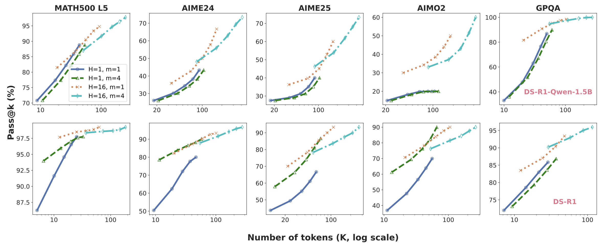

<div align="center">

# Fractured Chain-of-Thought Reasoning

</div>

## Table of Contents
- [Introduction](#introduction)
- [Environment Setup](#environment-setup)
- [Evaluation](#evaluation)

## Introduction
We introduce **Fractured Sampling**, a unified inference-time strategy that interpolates between full CoT and solution-only sampling along three orthogonal axes: (1) the number of reasoning trajectories, (2) the number of final solutions per trajectory, and (3) the depth at which reasoning traces are truncated. 
<p align="center">
  
</p>

**Main Takeaways**
1. 🌟 The H dimension (truncated CoT) shows the steepest log-linear scaling gains in Pass@k.
2. 🚀 Fractured sampling over all 3 dimensions offers the highest Pass@k.

<p align="center">
  
</p>
<p align="center">
  
</p>


## Environment Setup
```bash
conda create -n frac_cot python=3.10
conda activate frac_cot
pip install -r requirements.txt
```

## Evaluation
```bash
# Generation
bash ./scripts/gen.sh
# Evaluate
bash ./scriots/passk.sh
```